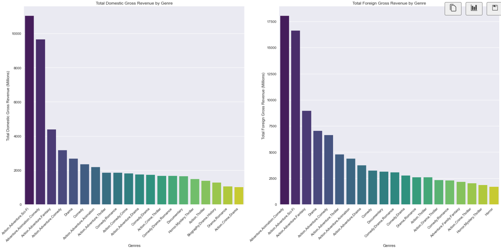
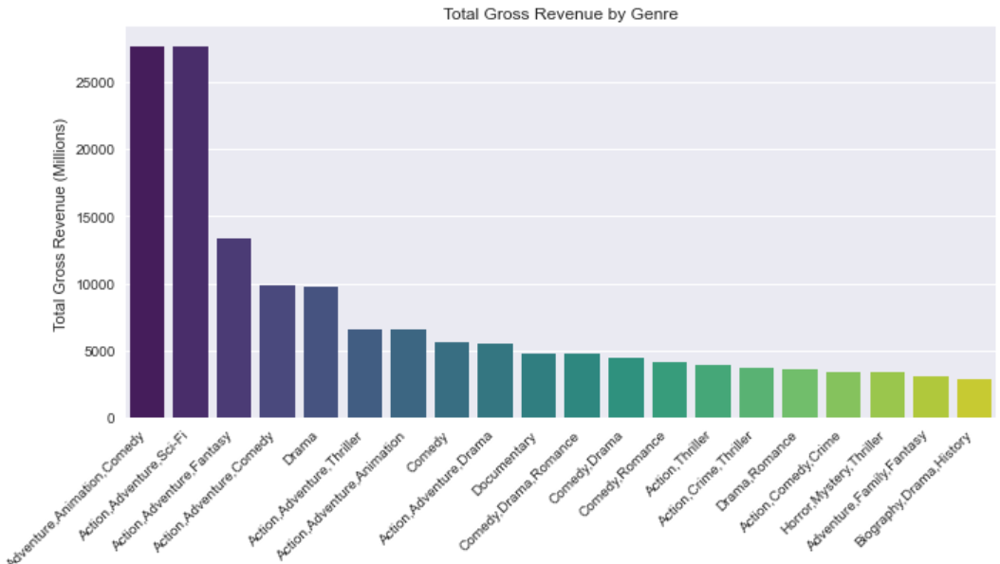

# Microosft Movie Analysis
**Author**: Maya

## Overview
This project analyzes data from IMDB dataset as well as data from Box Office Mojo to create actionable insights to assist Microsoft who want to venture into the film making business. The outcomes of the analysis can be used to guide Microsoft on what type of movies to make that yeild the most returns in the box office as well as movies that are appealing to viewers.

## Business Problem
Microsoft wants to go into the movie business but they lack film making expertise. They want to know what kinds of movies are doing well at the box office right now. To do this, they need to look at which genres are performing well at the box office and the preferences of the audience in respect to various genres. Doing this will help them prioritize which types of movies to make.

## Data
Data used in this analysis is data from IMDB as well as Box office mojo. Together these datasets provide information about the movies such aa the title, ratings and number of votes as well as data regarding the performance of movies at the box office.

## Methods
This project uses exploratory data analysis (EDA) to analyze different variables. This provides information about what films as well as their genres do well at the box office.

## Results
Films that have the combinations of Action, Adventure, Sci-Fi and Adventure, Animation, Comedy have the highest total domestic gross revenue.


Films with the combination of Adventure, Animation, Comedy and  Action, Adenture, Sci-Fi have the highest total foreign gross revenue.



Movies with the genre Adventure, Animation, Comedy as well as Action, Adventure, Sci-Fi have the highest total gross (domestic + foreign).



## Conclusions
This analysis lead to the following recommendations for Microsoft:

- **Movie combinations of Action,Adventure,Sci-Fi and Adventure,Animation,Comedy do very well in both domestic and foreign markets.** These film combinations also have high total gross revenues that is domestic plus foreign revenues. Microsoft can consider making movies with the above combinations. 

- **Action,Adenture,Sci-Fi movie combinations along with Action,Thriller and Adventure,Drama,Sci-Fi moves have the highest number of votes.**The films coupled with these genres: Inception, The Dark Knight Rises and Interstellar can serve as good points to borrow ideas on what movies to make. Additionally, Microsoft can consider making sequels to these movies as a start.

- **Microsoft should make movies with a runtime of between 70 and 120 minutes as these types of movies recieved the highest ratings.**Additionally, the genres that recieved the highest rating had a watch time of the above and were the following genres: Adventure, Documentary, Drama.

## Next Steps
In order to produce a more robust analysis and further insights additional datasets may be added in order to look into other factors that may influence the domestic and foreign gross as well as other variables. This can be information about specific actors or directors that influence viewers to watch a particular movie.

## For More Information
See the full analysis in the [Jupyter Notebook](./movie_analysis.ipynb) or review this [presentation](./Movie_Analysis_Presentation.pdf).

## Repository Structure

```
├── images
├── zippedData
├── READme.md
├── Movie_Analysis_Presentation.pdf
└── movie_analysis.ipynb
```